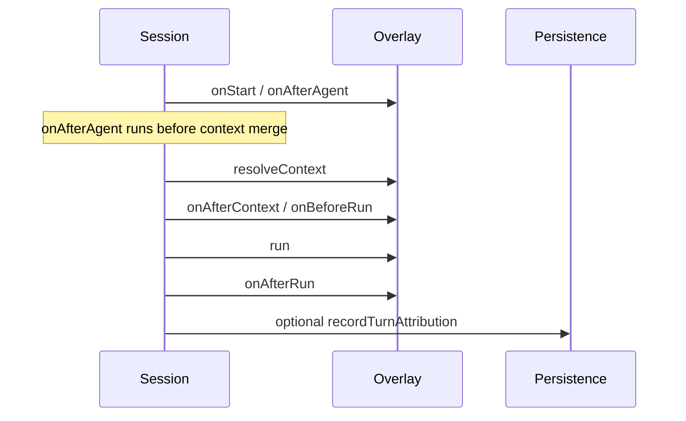

# Persistence (`AgentCapabilitiesPersistence`)

The canonical storage contract is Smithy `AgentCapabilitiesPersistenceService` in `@khoralabs/agent-capabilities-spec`. The TypeScript package provides a matching interface and a reference **in-memory** backend.

## SQLite analogy

| SQLite | Agent capabilities |
|--------|---------------------|
| `sqlite3.connect('app.db')` | Your DB adapter implementing `AgentCapabilitiesPersistence` |
| `sqlite3.connect(':memory:')` | `createMemoryAgentCapabilitiesPersistence()` |
| ORM + app code | `createAgentRegistry({ persistence })` — session host with default `:memory:` |

`createAgentRegistry()` with no arguments is equivalent to a session host wired to `:memory:` persistence. That is ideal for **tests and local prototypes**, not for multi-instance production catalogs.

## What persistence stores

- Registered agent templates (`UpsertRegisteredAgentSnapshot`, `GetLatestRegisteredAgentForAgent`)
- Session capability links (`RecordSessionCapabilityLink`, `GetLatestCapabilityLinkForSession`, `ListCapabilityLinksForAgent`)
- Runtime tool-ref snapshots, affordance envelopes, lineage transitions

## What stays host-local (orchestration overlay)

`createAgentRegistry` keeps a process-local overlay for:

- Live `RegisteredAgent.rootComposable` (required to evaluate tools)
- Session `hooks` and `run` handlers

Production: load or build `RegisteredAgent` in application code (factory by `agentId`); use your persistence implementation for attribution rows. The overlay is optional outside dev/tests.

## Production pattern

1. Implement `AgentCapabilitiesPersistence` against your database (Convex, Postgres, etc.).
2. On deploy/admin: `upsertRegisteredAgentSnapshot` with `registeredAgentToRegistrationRow(agent, op)`.
3. Per message/job: `captureAgentSnapshotEnvelope` (or `createCapabilityLink`), then `recordTurnAttribution(persistence, { op, sessionId, link, envelope })` — often in `onAfterRun`.
4. Pass `persistence` into `createAgentRegistry({ persistence })` if you want the same registry helper with durable storage for registrations and links.

## Session host lifecycle

`onAfterAgent` runs **before** merged session context is built; see checklist note on naming (`onAfterAgent` vs future rename).

## API entry points

- `createMemoryAgentCapabilitiesPersistence()` — `:memory:` backend
- `createAgentRegistry({ persistence?, opContext? })` — session host (default memory persistence)
- `recordTurnAttribution(persistence, { op, sessionId, link, envelope? })` — one-turn write helper
- Row builders: `registeredAgentToRegistrationRow`, `capabilityLinkToRow`, `envelopeToRow`, `defaultOpContext`

Related: [invocation context](invocation-context.md), [envelope schema versions](schema-versions.md).
